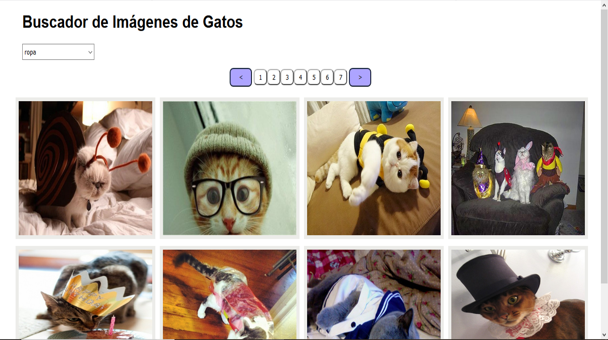

# Tarea DWEC07 - Buscador Imágenes de gatos

### JSON-Server basado en NodeJS
- Instalar NodeJS
- Instalar el paquete json-server: $ npm install -g json-server
- Arrancar el servidor del API: $ json-server --watch db.json

### Descripción
- Se han realizado dos peticiones AJAX
- La primera para obtener las diferentes categorías que se encuntran en el fichero db.json utilizando el servidor json-server
- La segunda para obtener las imágenes de la API de gatos: https://api.thecatapi.com. Para ello se requiere obtener una API Key registrandóse en dicha página

### Funcionamiento de la aplicación
- Se muestra un select con las categorías
- Al seleccionar una categoría, se muestran las 8 imágenes de la primera página así como la paginación
- Se puede navegar por las páginas, seleccionando cada página o pulsando los botones 'anterior' y 'posterior'

### Adjunto una imagen de cómo se vería la aplicación

